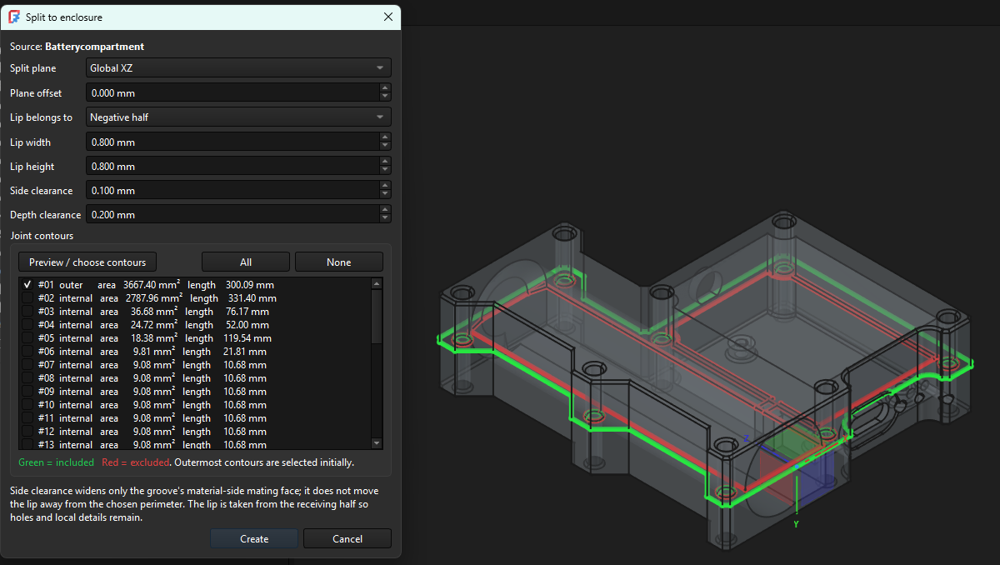
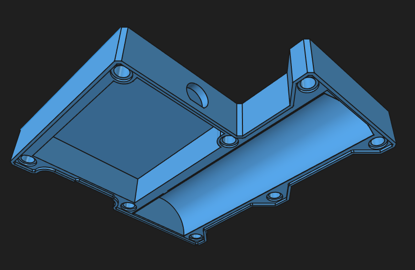
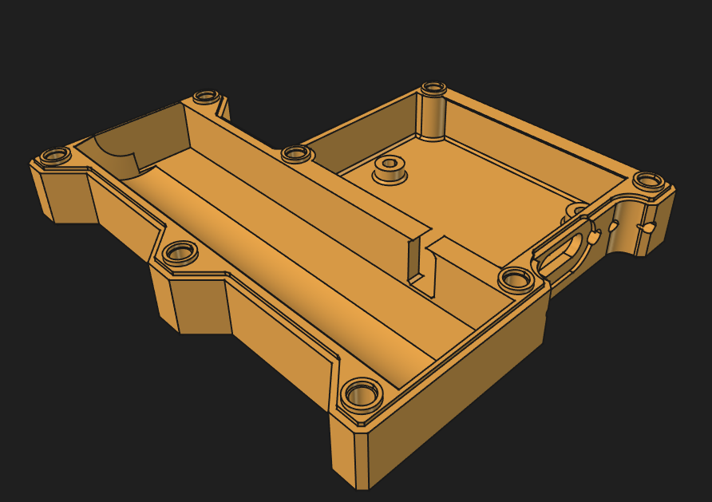

# Split2Enclosure

**Turn an existing FreeCAD solid into two printable enclosure halves with an
automatically generated lip-and-groove joint.**

Split2Enclosure is a FreeCAD 1.1 workbench for splitting complex solids into
enclosure halves while preserving the geometry around the joint — including
holes, bosses, curved walls, slopes and other local features. This allows you
to work on a single model and then split it into two parts for 3D printing.



## What it does

Split2Enclosure takes a solid like this and:

- splits it using a global plane, planar face, datum plane;
- detects the resulting joint contours automatically;
- lets you assign every contour to the negative half, positive half, or off;
- supports Shift/Ctrl multi-selection and shows each lip's extrusion direction;
- cuts a matching groove with configurable side and depth clearance;
- optionally drafts the joint and adds per-contour snap retention;
- preserves existing geometry around the split;
- produces two ready-to-export solid parts.

### Result

<table>
<tr>
<td width="50%">

**Top half**



</td>
<td width="50%">

**Bottom half**



</td>
</tr>
</table>

## Quick start

1. Select the solid you want to split.
2. Optionally Ctrl-select a planar face, datum plane, to use as
   the split reference.
3. Open the **Split2Enclosure** workbench.
4. Click **Split to enclosure**.
5. Choose the split plane and press **Preview / choose contours**.
6. Click contours in the 3D view, or Shift/Ctrl-select list rows and use
   **NEG**, **OFF**, or **POS**, to choose the lip owner.
7. Optionally select rows and press **SNAP** to add retention nubs and pockets.
8. Set lip dimensions, clearances, and optional draft.
9. Press **Create**.

The original solid is left untouched. Split2Enclosure creates two new
`Part::Feature` solids inside an App Part.

## Joint parameters

| Parameter | Description |
|---|---|
| **Default contour side** | Initial lip owner for newly previewed outer contours |
| **Lip width** | Width of the tongue measured into the wall |
| **Lip height** | Height of the tongue across the split |
| **Side clearance** | Additional lateral clearance in the mating groove |
| **Depth clearance** | Total axial clearance, shared between the lip root and groove tip |
| **Draft angle** | Optional taper on the generated lip and groove limiting volumes |
| **Snap radius** | Radius of each spherical retention nub |
| **Snap clearance** | Radial clearance added to the matching snap pocket |
| **Snap height fraction** | Nub position from lip root (`0.1` to `0.9`) |

Blue contours/arrows are lips owned by the **negative** half, orange by the
**positive** half, and gray contours are **off**. `[SNAP]` in a list row means
that contour also receives retention geometry.

## Install

Clone or copy the complete repository folder into FreeCAD's user `Mod`
directory. On a typical Windows FreeCAD 1.1 installation it is:

```text
%APPDATA%\FreeCAD\v1-1\Mod\Split2Enclosure
```

Restart FreeCAD and select the **Split2Enclosure** workbench. Keep the whole
folder together; `Split2Enclosure.FCMacro` is only a launcher for the installed
Python package.

## Use

1. Select one object whose `Shape` contains a valid solid.
2. Optionally Ctrl-select a planar face, Part Design datum plane, or connected
   open sketch. For a sketch split, draw the path on a side of the model and
   extend both endpoints beyond the enclosure.
3. Run **Split2Enclosure > Split to enclosure**.
4. Choose the plane/sketch split mode and signed offset (plane modes only),
   then press **Preview / choose contours**.
5. Assign contours with **NEG**, **OFF**, and **POS**. Shift/Ctrl-selection
   applies an assignment to several rows; clicking a contour or its arrow in
   the 3D view cycles its assignment.
6. Optionally use **SNAP** on selected rows, then choose joint dimensions,
   clearances, and draft angle.
7. Press **Create**. The original is hidden and an App Part containing the two
   resulting halves is added to the document.

Plane normals and positive offset directions are:

| Plane | Positive normal |
|---|---|
| XY | +Z |
| XZ | +Y |
| YZ | +X |

`Side clearance` is added only at the material-side mating face: the lip stays
anchored to the selected perimeter and the groove extends farther into the
wall. `Depth clearance` is split symmetrically between a root shoulder relief
on the lip half and extra room beyond the lip tip on the receiving half.

## Configurable defaults

Edit `split2enclosure_defaults.json` in the add-on's root directory to change
the values used whenever the dialog opens. The included file documents all
supported keys by example: lip width/height, both clearances, draft angle,
default lip side, and the three snap settings. Values use millimetres, degrees,
or the unitless snap-height fraction as appropriate. Restarting FreeCAD is not
required; defaults are read when a new dialog is opened. Invalid files produce
a warning and safely fall back to built-in defaults.

## Geometry model

The engine intersects the source BRep with the split plane and classifies every
closed contour for display. It builds a two-sided planar offset band around the
user-selected contours and clips that band to the actual wall material.

For an open-sketch split, the engine extrudes the sketch along its support-plane
normal beyond the model bounds. OpenCASCADE partitions the body with the
resulting ruled surface. Each planar surface panel receives its own local joint
normal, while connected boundary edges are unfolded into sketch-path-distance
coordinates for outer/internal contour classification. Lip material is then
transferred face-by-face and the exact transferred shape is included in the
groove cut to prevent overlap at angled mitres.

The groove is cut with a widened/deepened band. The nominal lip prism is first
intersected with the unmodified receiving half, and only that existing material
is transferred to the lip half. Consequently, holes, slopes, curved walls, and
features beginning immediately after the split plane remain in the lip instead
of being covered by a uniform extrusion.

An optional draft angle lofts between the root footprint and a smaller tip
footprint. On unusually complex clipped sketch panels where OpenCASCADE cannot
construct that loft, only the affected panel falls back to a straight prism.
Per-contour snap retention adds a spherical nub to the lip owner and cuts a
larger concentric pocket from the mating half.

Full-circle contours use an exact analytic offset because OpenCASCADE's 2D
offset builder can return a null result for a wire made from one circular edge.
If OpenCASCADE rejects another complex closed contour, the engine falls back to
a finely discretized GEOS/Shapely offset for that contour only.

This is more reliable than collecting model edges by name: FreeCAD's generated
edge numbers can change after Boolean operations, while the cross-section is
derived directly from the final solid.

## Current limitations

- The source must be a BRep solid, not a mesh. Convert meshes before running.
- Joint paths must be closed. A vertical cut through an open-top shell can
  produce an open U-shaped cavity boundary, which cannot yet be selected.
- Sketch splits currently accept exactly one connected, open chain made from
  line segments. Branches, self-intersections, closed profiles, arcs, and
  B-splines are not yet supported.
- A sketch split must divide the source into exactly two solids. Its endpoints
  should extend beyond the projected model boundary.
- Very thin walls, tight concave radii, or a lip wider than the available wall
  can make offsets fail. Reduce width/clearance or move the plane.
- Results are static features. Change parameters by deleting the result group
  and running the command again.
- Snap retention currently places one spherical nub at a deterministic point
  on each enabled contour. Multiple nubs or drag-to-position are not yet
  supported.

## Completed TODOs in v0.4.0

- [x] Split depth clearance between the lip root and groove tip.
- [x] Add optional draft angle to lip and groove.
- [x] Harden sketch splits against missing panels and Boolean debris.
- [x] Assign every profile independently to negative, positive, or off.
- [x] Shift/Ctrl-select several profiles and assign them together.
- [x] Visualize lip extrusion direction with colored arrows.
- [x] Add configurable per-profile snap retention.
- [x] Load user-editable defaults from the add-on directory.

## Tests and sample

Run the headless regression suite with the matching FreeCAD executable:

```powershell
& 'C:\Program Files\FreeCAD 1.1\bin\FreeCADCmd.exe' 'tests\run_geometry_tests.py'
```

Generate a visual `.FCStd` example:

```powershell
& 'C:\Program Files\FreeCAD 1.1\bin\FreeCADCmd.exe' 'examples\create_sample.py'
```

## License

Split2Enclosure is released under the [MIT License](LICENSE).

## Disclaimer

This work is made with OpenAI Codex, and I am a hobbyist who needed this
functionality. I am not a professional software developer. Use at your own
risk.
